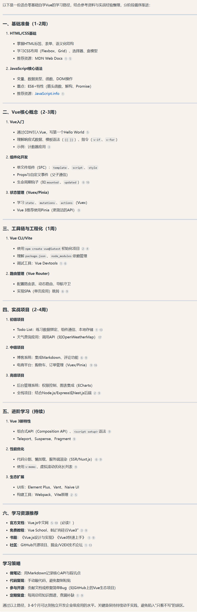
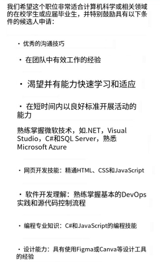

# 哈希
- 常见的三种哈希结构：哈希表（键值存储数据），哈希树（完整性校验、区块链），一致性哈希（用于分布式系统，哈希环使得服务器增删对数据影响小）
- 哈希法：利用哈希函数将数据映射到特定存储位置的技术。进而达到快速存取。常用于哈希查找、哈希表、数据库索引、加密、负载均衡等。
	- 哈希法用于解决问题涉及三种结构：数组，set，map（映射）
-
- BOSS打招呼：
	- 您好，认真看了贵司的岗位JD，简单的做个自我介绍方便您快速匹配：
	  2.在校期间通过了六级，有良好的英语阅读能力
	  3.毕业以后就进入一家军企工作，有android，python，Java，嵌入式C的开发经验，可以灵活运用android的四大组件，熟悉android的调试，也熟悉android的第三方运行库sqlite
	  4.曾编写各种软件测试大纲
	  5.本人性格比较乐观，善于沟通
	  期待和您有关于岗位的深度沟通，方便的话发给您详细简历。
- # SISALL前端
- 国内现在比较新的css相关的，tailwind
-
- 如何了解前沿技术：
	- 阮一峰的周刊 http://www.ruanyifeng.com/blog/
	- 看招聘信息再决定学什么
-
- 前端想转全栈，不用考虑java，可以考虑使用nest
- 分享一个不错的网站：https://www.codecrack.cn/zh/javascript，
- 一些网址：
	- https://csdiy.wiki/
	- https://doocs.github.io/advanced-java/#/
	- https://liaoxuefeng.com/books/java/introduction/index.html
	- https://www.github-zh.com/awesome
-
- lhg-全栈
	- 瑞典
		- 工作大概8年基本都是做网站开发 有时会需要做一些devops的东西，刚入行时用过2年python， 后来都在用 typescript, node.js 前端我只用过react(不过我个人对 vue angular 也不并不是很感兴趣)
		- node.js比较小众 一般公司可能不太会随便尝试太新的技术 都有很多技术债😂 用nextjs都算新的了相比之下我感觉瑞典程序员的面试没那么难 不需要记那么多知识点 更侧重实际应用一些
		- 有工作经验的话完全可以直接投工作, 就在领英上搜开放岗位就可以 各种方向都有 不一定需要转全栈才能找到工作 虽然现在行情不是特别好开放岗位可能不会很多
	- 推荐2个我个人感觉作者很会讲解概念的主要关于JS/react的技术博客：
	  这个比较适合初学者  比较容易理解 他介绍的内容也很实用  https://www.robinwieruch.de/blog/ 
	  他最新的教程是关于Nextjs的 感兴趣的话也可以了解一下 The Road to Next
	- 这个博客主要是关于 react 更深度的介绍 有些内容现实中一般情况比较少会用到 适合对 react 很感兴趣且想要深度了解的人😄 https://www.developerway.com/
-
-
-
-
- 佳-前端（web-8年）
	- 建议：
		- 1.系统化的学习从0开始前端从html css  javascript先入手（这三件套看b站黑马）。国内vue用的多一些。
		- 2.如果后续在国外发展可以直接学react，angular也比较多（出海基本都是react，不做出海就只是看公司技术栈是不是vue了），接着next.js（国外全栈更多）
		- 3.从搭建自己的个人静态网页开始
		- 4.单纯前端也会要求了解后端，aws
		- 5.国外找前端都希望有个个人网站/github主页也装饰一下，如果现在前端遇到瓶颈的，我建议用next.js，vercel部署平台，搭建一个个人网站（很好玩）
			- 教程：
				- 1.youtube搜portfolio website这个关键字
				- 2. https://www.youtube.com/@CodeBucks
				- 3.学html和css看这个 {{video https://www.youtube.com/watch?v=G3e-cpL7ofc}}
				- 4.作品抄的这个，需要熟悉一下react.js，然后读一下next.js的官网  {{video https://www.youtube.com/watch?v=Yw7yWHigGKI&t=490s}}
			- Tips：vercel是个免费部署平台，只要用你的github账号登陆，关联github项目，就能很轻松部署
		- 希望大家在学习技术的过程，不要仅仅沉浸在枯燥的知识点里，就给自己一个目标做出来简单点demo会比较有动力
		- next.js	比较火，利于全栈开发
	- 作品：https://zhangmengjia.vercel.app/
-
-
- Asa-前端
	- 刚学前端时听的Udemy上Angela Yu的课，讲得还挺好的：https://www.udemy.com/share/1013gG/
	- Udemy的课应该是每年更新的，这个好像是全栈的。如果看的话，bootstrap可以跳过，国内感觉很少用这个
-
- blue-算法
	- 个人网站教程关键词：github hexo 博客
-
- VUE路线图 
- 粘粘-Java
	- https://zhuanlan.zhihu.com/p/102592286    这个是我古早以前还没转码的时候收藏的，搭个人博客的，属于是没代码基础都能搞有手就行（但是自己优化界面还是得懂html css之类的
-
-
- tailwind用得我现在已经不会写原生css了
-
-
- 问题：看next文档 然后写着服务端渲染的时候是一次网络请求就会渲染一次 这个网络请求指的是对页面文件的请求吗 还是每次请求后端api的话都会重新渲染一次？
	- 答：
	- ✅ 页面请求（访问 URL）会触发 SSR，页面会重新渲染。
	  ✅ getServerSideProps 里的 API 请求会随 SSR 一起执行，但不会因 API 变化单独触发 SSR。
	  ❌ 前端的 API 请求（useEffect 里的 fetch）不会触发 SSR，它只是修改 React 组件状态，不会让整个页面重新渲染。
	- 所以，每次页面请求都会重新渲染一次（触发 SSR），但 API 请求本身不会导致 SSR 重新执行
	- 所以是调用了ssr相关功能才会触发重新渲染
-
- # AI设计工具
	- 1.Galileo Al-根据文本生成 Ul 设计
	- 2.Uizard -快速生成可交互的 U 原型
	- 3.Anima-设计到代码的自动化工具
	- 4.Figma Al插件-设计建议、自动布局优化
	- 5.Khroma-Al推荐最佳色彩搭配
	- 6.Runway ML-生成 Ul 设计素材
-
-
- # 后端
- 我个人感觉哈，学技术主要就是不要害怕，看看书就去折腾
- 现在还可以问ds
- 梯子：
	- 1. 花禾25/月 https://huahualuzi.com/
		- 2. 一元机场（20几有两年）
			- https://github.com/yiyuanjichang/dizhi（防止网站失效）
			- https://xn--4gq62f52gdss.ink/#/dashboard（要翻墙版本）
			- https://xn--1-q07a56pdss.com/#/login（不用翻墙版本）
- 某司实习岗的JD
	- {:height 525, :width 315}
-
-
- 分享一个不错的网站： https://xiaolincoding.com/
-
-
- 九-后端移动端（c转java转lua转android转后端还搞ios）
	- 推荐项目：
		- 这三个项目跑起来 看一下就好了
		- https://github.com/pig-mesh/pig
		- https://github.com/yangzongzhuan/RuoYi
		- https://github.com/renrenio/renren-fast-vue
-
- 粘粘-java
	- 目前国内java岗多，go就业比较窄一般大厂用的多（性能强），正常建议学java，国内java要学到微服务
	  id:: 67c951d7-ed00-47ff-a8ce-8b72e3f7f385
	- 学习路线参考黑马：{{video https://www.bilibili.com/opus/494817843530680807}}
	- 自学路线图：
		- 1.java语法，还要学反射，多线程那些（我当时这块没认真学，后来做项目遇到以这块为基础的封装都很云里雾里）
		- 2.Springboot框架（SSM框架）
		- 3.做个CRUD单体项目
		- 4.拆单体项目成分布式微服务 （网上很多岗位都会要求懂MessageQueue（RabbitMQ, Kafka）， docker 一般在微服务阶段的项目就都有涉及。
		- 5.很多岗位都要求还得会运维的东西 CI/CD之类的，可能大概要学什么jenkins 之类的东西，还有AWS云服务，也经常在岗位描述上看到，应该也是和运维部署有关系，目前只知道EC2（我理解就是云上虚拟机，应该是要把项目部署在上面）和S3（存文件的）。这块没看到什么好的教程
			-
			-
			-
			-
- AWS那块经常在JD里看到，现在个人基本属于开发完不知道后续步骤该做什么，云服务器，数据库如何部署，有什么网上平台啥的
- ->就是如何暴露服务
- ->把服务部署上去，然后开个端口暴露服务，然后就能通过ip:port访问服务。但我们一般不会想要暴露自己的服务器ip。所以一般会通过域名访问，可能再加个nginx转发。 要学习的话可以先试着买个便宜的服务器，搞一下。
	- 问：买个便宜的服务器，有没有推荐平台?
	- 答1：阿里云第一年有便宜的，https://bandwagonhost.com/ 还可以看看这里还有没有19.9刀的；
	- 答2：可以看下亿速云，华为啥的，这种基本上都有试用和首单优惠，我前司就天天薅这种
	-
- 服务端其实也要看大家想学什么方向的。如果是devops方向就要学。 如果知识想做普通的业务开发，其实不需要深入学习，知道有这个东西就行
	- 很多岗位（海外的）对DevOps都有一定的要求。 关于DevOps推荐一下这个Up主的视频：【DevOps爹妈级扫盲（CICD/Waterfall/Agile）】 https://www.bilibili.com/video/BV1uF4m1L7o7/?share_source=copy_web&vd_source=df3132cd2d21861b371106b5cab0889c
-
-
- 贝贝-业务服务端开发
	- 建议：
		- 1. 会用 JAVA / C++/ C 其中一门语言（其实还有很多其他的语言，这三种比较基础可以先学，如果不想学其实也可以直接学其他的语言，比如直接学go感觉也没啥问题）
		- 2.了解使用python/nodejs/ shell 其中一种脚本语言
		- 3.持久数据存储 ：MySQL\MongDB\TiDB\其他   至少会一个，其他的了解基本原理和其优势、使用场景（熟练掌握）
		- 4.缓存数据库：Redis\ES\ 其他 （redis基本是必会的）
		- 5. 消息队列：Kafka、RabbitMQ 等其他消息队列
		- 6. 数据结构、算法
		- background-color:: green
		  7. 操作系统、网络知识、架构设计、 💁‍♀️设计模式（重要）
			- 问：设计模式（重要）  这个有什么课或者学习方向的吗？
			- 答：
				- 1. https://github.com/mukul96/System-Design-AlexXu/blob/master/System%20Design%20Interview%20An%20Insider%E2%80%99s%20Guide%20by%20Alex%20Xu%20(z-lib.org).pdf
				- 2.设计模式其实可以看 6大设计原则先 23种设计模式 都是这6大原则的扩充 ->
					- https://blog.csdn.net/Allen202/article/details/143231363
				- 3. 我之前考软件设计师遇到过考设计模型的，就讲得很应试->
			-
		- 8. 微服务架构、了解rpc； 可以学习一下protobuf
		- 9. 微服务治理：k8s   (不是所有公司都会用，一般只有微服务数量很多,比如几百个，人工维护已经很麻烦的时候才会使用，因为其实也需要一定的学习和运维成本)
-
-
- # AI 开发岗
- 找ai相关的客户端开发，找到相关岗位进去接触一下这行业
- 学机器学习，统计学（推荐统计学是因为，感觉工作里很需要统计学的思维+一些专业术语唬住领导（这是可以说的吗）
- AI 算法开发是要用 python，如果有ML的基础会是优势（ML掉包简单，最好能手撕几个经典的算法）
-
- # 虚拟语气
-
-
-